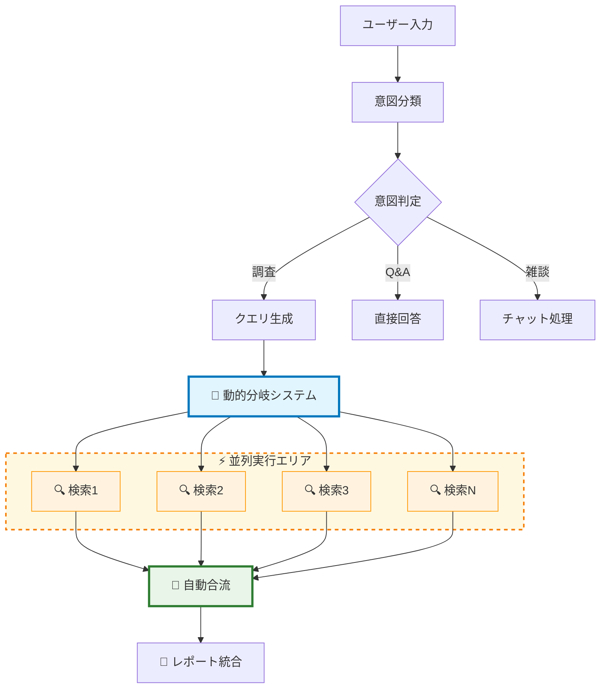
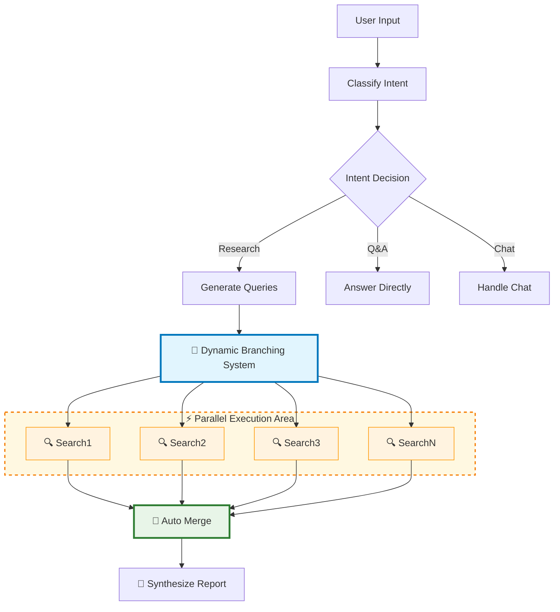

# 🚀 Go フルスタック リサーチアシスタント v1.1.0

**純粋なGoで構築された**マルチプラットフォーム対応の強力な自律型調査アシスタント！動的グラフ分岐、リアルタイムストリーミング、並列検索による包括的な調査機能を提供します。

## 🎯 3つのインターフェース

| インターフェース | 説明 | 適用場面 |
|------------------|------|----------|
| 🖥️ **CLI版** | ターミナルベースのインターフェース | パワーユーザー、スクリプト、サーバー環境 |
| 🌐 **Web版** | 動的グラフ分岐とリアルタイム可視化 | インタラクティブ分析、チーム共同作業 |  
| ⚡ **WASM版** | ブラウザネイティブGo実行 | オフライン利用、クライアントサイド処理 |

## ✨ 主な特徴

### 🔄 **NEW! 動的グラフ分岐システム (v1.1.0)**
- **インテリジェント分岐**: 検索クエリごとに独立したノードを動的生成
- **並行実行**: 各検索クエリが同時並行で実行される
- **自動合流**: 個別検索結果を統合ノードで自動マージ
- **リアルタイム表示**: 分岐・合流プロセスの可視化

### 🏗️ **リファクタリング済みアーキテクチャ (v1.1.0)**
- **堅牢なJSONパース**: gjsonライブラリによる信頼性の高い解析
- **統一設定管理**: viperによる型安全な設定システム
- **モジュラーフロントエンド**: CSS/JavaScript責任分離
- **内部パッケージ化**: `internal/config/`による構造化

### 🚀 **コア機能**
- **意図ベースルーティング**: ユーザー入力を自動的に調査、Q&A、雑談に分類
- **自律的調査**: 複数の検索クエリを生成し並列実行
- **包括的レポート**: 検索結果を構造化されたレポートに統合
- **ストリーミング更新**: グラフ実行中のリアルタイム進捗表示
- **並行処理**: Goのgoroutineを活用した効率的な並列検索
- **実際のWeb検索**: SerpAPIによる本物のGoogle検索結果
- **ノード状態可視化**: Web版でのリアルタイム実行状態表示

## 🏗️ アーキテクチャ

LangGraphにインスパイアされた次世代グラフベースアーキテクチャ：

### 🧠 **コアコンポーネント**
1. **状態管理**: スレッドセーフな`AppState`が実行全体のコンテキストを維持
2. **ノード**: 個別の処理ユニット（意図分類、クエリ生成、動的検索、統合）
3. **エッジ**: 状態に基づくノード遷移の制御フロー + 動的分岐制御
4. **エンジン**: ストリーミング更新と動的ノード生成をサポート

### 🔄 **動的グラフフロー (v1.1.0)**



### 🎯 **技術スタック**
- **バックエンド**: Go 1.21+ / goroutines / sync
- **JSONパース**: github.com/tidwall/gjson
- **設定管理**: github.com/spf13/viper
- **フロントエンド**: 純粋JavaScript ES6+ / WebSocket / CSS3
- **外部API**: OpenAI GPT-4o / SerpAPI

## 📋 必要条件

- Go 1.21以上
- OpenAI APIキー
- SerpAPIキー（オプション、実際のWeb検索用）

## 🚀 インストール

1. リポジトリをクローン:
```bash
git clone https://github.com/takako/openai-go-demo.git
cd openai-go-demo
```

2. 依存関係をインストール:
```bash
make deps
```

3. 環境変数ファイルを作成:
```bash
cp .env.example .env
```

4. APIキーを`.env`に追加:
```
OPENAI_API_KEY=your-openai-api-key-here
SERPAPI_KEY=your-serpapi-key-here
```

**APIキーの取得:**
- OpenAI API: https://platform.openai.com/api-keys
- SerpAPI（実際のGoogle検索用）: https://serpapi.com/manage-api-key

## 🎮 使用方法

### すべてのバージョンをビルド
```bash
make build-all
```

### 1. CLI版の実行
```bash
make build-cli
./bin/research-cli
```

### 2. Web版の実行（推奨！）
```bash
make serve-web
# http://localhost:8080 をブラウザで開く
```

**Web版の特徴:**
- **リアルタイムノード状態可視化**
- **パルス効果付きグラフ表示**
- **WebSocketストリーミング**
- **LIVE出力表示**

### 3. WASM版の実行
```bash
make serve-wasm
# http://localhost:3000 をブラウザで開く
```

**WASM版の特徴:**
- **ブラウザ内で完全Go実行**
- **オフライン動作可能**
- **クライアントサイド処理**

### インタラクティブコマンド

- 調査したいトピックを入力
- `stream` - ストリーミングモードの切り替え
- `exit` または `quit` - アプリケーション終了

### クエリの例

**調査モード:**
- "Go言語の最新動向について教えて"
- "量子コンピュータの現在の開発状況を調べて"
- "AI規制の最新状況について調査して"

**Q&Aモード:**
- "フランスの首都は？"
- "goroutineの仕組みは？"

**チャットモード:**
- "こんにちは"
- "ありがとう"

## 📁 プロジェクト構成 (v1.1.0 リファクタリング済み)

```
📁 openai-go-demo/
├── 🖥️  cmd/cli/main.go     ← CLI版メイン
├── 🌐 cmd/web/main.go     ← WebSocketサーバー + 静的ファイル配信
├── ⚡ cmd/wasm/main.go    ← WASM版メイン
├── 🧠 graph/              ← 共通ロジック
│   ├── state.go          ← AppState定義と管理（スレッドセーフ）
│   ├── nodes.go          ← ノード実装（gjson使用）
│   ├── edges.go          ← エッジロジック + 動的分岐制御  
│   ├── engine.go         ← グラフ実行エンジン（動的ノード対応）
│   └── utils/            ← 共通ユーティリティ (NEW!)
│       ├── logger.go     ← 構造化ログ
│       └── streaming.go  ← ストリーミングヘルパー
├── 🔧 internal/          ← 内部パッケージ (NEW!)
│   └── config/           
│       └── config.go     ← viper統一設定管理
├── 🔍 tools/serpapi.go    ← SerpAPI検索クライアント
├── 🎨 web/static/         ← モジュラーWeb UI (NEW!)
│   ├── index.html        ← メインHTML構造
│   ├── css/styles.css    ← 全CSS統合
│   └── js/               ← JavaScript責任分離
│       ├── websocket.js  ← WebSocket管理
│       ├── graph.js      ← グラフ表示・動的ノード
│       └── app.js        ← メインアプリケーション
├── ⚡ wasm/               ← WASM UI（ブラウザネイティブ）
├── 📋 Makefile           ← ビルドスクリプト
└── 📄 .env               ← 環境変数（リポジトリに含まず）
```

## 🔧 主要コンポーネント (v1.1.0 アップデート)

### 🧠 **AppState (強化版)**
スレッドセーフな操作によるノード間共有状態管理:
- ユーザー入力と意図分類
- 検索クエリと結果（動的マッピング対応）
- 最終レポート生成
- エラーハンドリング + ストリーミングコールバック

### 🔄 **ノード (動的分岐対応)**
- **ClassifyIntentAndTopic**: ユーザー意図の判定と調査トピック抽出
- **GenerateSearchQueries**: gjsonライブラリによる堅牢なクエリ生成
- **動的検索ノード**: クエリごとに動的生成される個別検索ノード（NEW!）
- **MergeSearchResults**: 並行検索結果の自動統合ノード（NEW!）
- **SynthesizeAndReport**: 結果を構造化レポートに統合

### ⚙️ **エンジン (動的ノード生成対応)**
以下の機能でグラフ実行をオーケストレーション:
- 動的ノード生成とライフサイクル管理（NEW!）
- "branch:search_query"シグナルによる分岐制御（NEW!）
- 無限ループ防止のための最大ステップ制限（25ステップに拡張）
- リアルタイム進捗のストリーミング更新
- 実行パス追跡
- エラー伝播とハンドリング

### ⚡ **設定管理システム (NEW!)**
viperベースの型安全な統一設定:
```go
type Config struct {
    Server   ServerConfig   // ポート、ホスト設定
    OpenAI   OpenAIConfig   // APIキー、モデル設定
    SerpAPI  SerpAPIConfig  // 検索API設定
    Graph    GraphConfig    // グラフ実行設定
    Logging  LoggingConfig  // ログレベル設定
}
```

## 🛠️ Makefileコマンド

```bash
make help          # 利用可能なコマンド一覧
make build-all     # 全バージョンビルド
make build-cli     # CLI版ビルド
make build-web     # Web版ビルド
make build-wasm    # WASM版ビルド
make serve-web     # Web版サーバー起動
make serve-wasm    # WASM版サーバー起動
make demo          # デモ環境セットアップ
make clean         # ビルド成果物削除
make test          # テスト実行
```

## 🎨 拡張方法

### 新しいノードの追加

1. `nodes.go`でノード関数を定義:
```go
func (r *NodeRegistry) YourNewNode(ctx context.Context, state *AppState) error {
    // ノードロジック
    return nil
}
```

2. `NewNodeRegistry`でノードを登録:
```go
registry.RegisterNode("your_new_node", registry.YourNewNode)
```

3. `edges.go`でエッジロジックを更新

### 実際の検索ツールの追加

`ExecuteParallelSearch`の模擬検索を実際の検索APIに置換:
- Tavily API（Web検索）
- GitHub API（コード検索）
- arXiv API（学術論文検索）

## ⚡ パフォーマンス考慮事項

- **並列実行**: 検索操作が並行実行され、総実行時間を大幅短縮
- **ストリーミング更新**: 進捗更新がメイン実行をブロックしない
- **スレッドセーフ状態**: 並行操作が共有状態を安全に更新
- **コンテキストキャンセレーション**: 適切なクリーンアップのための全操作でのコンテキストサポート

## 📈 リリース履歴

### 🎉 v1.1.0 (2025年) - 動的分岐システム + リファクタリング
- ✨ **NEW**: 動的グラフ分岐・合流システム
- ✨ **NEW**: gjsonライブラリによる堅牢なJSONパース
- ✨ **NEW**: viper統一設定管理システム
- ✨ **NEW**: モジュラーフロントエンド（CSS/JS分離）
- ✨ **NEW**: `internal/config/`構造化
- ⚡ Web UIリアルタイム分岐表示
- 🔧 最大ステップ数25に拡張

### 🚀 v1.0.0 (2025年) - 初回リリース
- 🎯 意図ベースルーティング
- 🌐 3つのインターフェース（CLI/Web/WASM）
- 🔍 SerpAPI実検索統合
- 📊 リアルタイムグラフ可視化
- ⚡ 並行検索処理

## 🔒 ライセンス

このプロジェクトは実演目的です。OpenAIの利用規約を遵守してください。

---

# 🚀 Go Full-Stack Research Assistant v1.1.0

A powerful autonomous research assistant built with **pure Go** across multiple platforms! Features dynamic graph branching, real-time streaming, and comprehensive research using parallel search operations.

## 🎯 Multiple Interfaces Available

| Interface | Description | Best For |
|-----------|-------------|----------|
| 🖥️ **CLI** | Terminal-based interface | Power users, scripting, server environments |
| 🌐 **Web** | Dynamic graph branching with real-time visualization | Interactive analysis, team collaboration |  
| ⚡ **WASM** | Browser-native Go execution | Offline use, client-side processing |

## ✨ Features

### 🔄 **NEW! Dynamic Graph Branching System (v1.1.0)**
- **Intelligent Branching**: Dynamically generates independent nodes for each search query
- **Parallel Execution**: All search queries execute simultaneously in parallel  
- **Automatic Merging**: Individual search results automatically merged at convergence node
- **Real-time Visualization**: Live display of branching and merging processes

### 🏗️ **Refactored Architecture (v1.1.0)**
- **Robust JSON Parsing**: Reliable parsing using gjson library
- **Unified Configuration**: Type-safe configuration system with viper
- **Modular Frontend**: Separated CSS/JavaScript responsibilities  
- **Internal Packaging**: Structured with `internal/config/` organization

### 🚀 **Core Features**
- **Intent-based Routing**: Automatically classifies user input as research requests, Q&A, or general chat
- **Autonomous Research**: Generates multiple search queries and executes them in parallel
- **Comprehensive Reports**: Synthesizes search results into well-structured research reports
- **Streaming Updates**: Real-time progress updates during graph execution
- **Concurrent Processing**: Leverages Go's goroutines for efficient parallel search operations
- **Real Web Search**: Actual Google search results via SerpAPI
- **Node State Visualization**: Real-time execution state display in Web version

## 🏗️ Architecture

Next-generation graph-based architecture inspired by LangGraph:

### 🧠 **Core Components**
1. **State Management**: Thread-safe `AppState` maintains context throughout execution
2. **Nodes**: Individual processing units (intent classification, query generation, dynamic search, synthesis)
3. **Edges**: Control flow logic with dynamic branching control + state-based transitions
4. **Engine**: Orchestrates execution with streaming updates and dynamic node generation

### 🔄 **Dynamic Graph Flow (v1.1.0)**



### 🎯 **Technology Stack**
- **Backend**: Go 1.21+ / goroutines / sync
- **JSON Parsing**: github.com/tidwall/gjson
- **Configuration**: github.com/spf13/viper
- **Frontend**: Pure JavaScript ES6+ / WebSocket / CSS3
- **External APIs**: OpenAI GPT-4o / SerpAPI

## 📋 Prerequisites

- Go 1.21 or higher
- OpenAI API key
- SerpAPI key (optional, for real web search)

## 🚀 Installation

1. Clone the repository:
```bash
git clone https://github.com/takako/openai-go-demo.git
cd openai-go-demo
```

2. Install dependencies:
```bash
make deps
```

3. Create a `.env` file:
```bash
cp .env.example .env
```

4. Add your API keys to `.env`:
```
OPENAI_API_KEY=your-openai-api-key-here
SERPAPI_KEY=your-serpapi-key-here
```

**Getting API Keys:**
- OpenAI API: https://platform.openai.com/api-keys
- SerpAPI (for real web search): https://serpapi.com/manage-api-key

## 🎮 Usage

### Build All Versions
```bash
make build-all
```

### 1. CLI Version
```bash
make build-cli
./bin/research-cli
```

### 2. Web Version (Recommended!)
```bash
make serve-web
# Open http://localhost:8080 in browser
```

**Web Version Features:**
- **Real-time node state visualization**
- **Pulsing graph display effects**
- **WebSocket streaming**
- **LIVE output display**

### 3. WASM Version
```bash
make serve-wasm
# Open http://localhost:3000 in browser
```

**WASM Version Features:**
- **Complete Go execution in browser**
- **Offline operation capability**
- **Client-side processing**

### Interactive Commands

- Type your query or research topic
- `stream` - Toggle streaming mode for real-time updates
- `exit` or `quit` - Exit the application

### Example Queries

**Research Mode:**
- "Research the latest developments in quantum computing"
- "Tell me about WebAssembly support in Go"
- "Investigate the current state of AI regulation"

**Q&A Mode:**
- "What is the capital of France?"
- "How do goroutines work?"

**Chat Mode:**
- "Hello, how are you?"
- "Thanks for your help!"

## 📁 Project Structure (v1.1.0 Refactored)

```
📁 openai-go-demo/
├── 🖥️  cmd/cli/main.go     ← CLI version main
├── 🌐 cmd/web/main.go     ← WebSocket server + static file serving
├── ⚡ cmd/wasm/main.go    ← WASM version main
├── 🧠 graph/              ← Common logic
│   ├── state.go          ← AppState definition and management (thread-safe)
│   ├── nodes.go          ← Node implementations (gjson-powered)
│   ├── edges.go          ← Edge logic + dynamic branching control
│   ├── engine.go         ← Graph execution engine (dynamic node support)
│   └── utils/            ← Common utilities (NEW!)
│       ├── logger.go     ← Structured logging
│       └── streaming.go  ← Streaming helpers
├── 🔧 internal/          ← Internal packages (NEW!)
│   └── config/           
│       └── config.go     ← Viper unified configuration
├── 🔍 tools/serpapi.go    ← SerpAPI search client
├── 🎨 web/static/         ← Modular Web UI (NEW!)
│   ├── index.html        ← Main HTML structure
│   ├── css/styles.css    ← Consolidated CSS
│   └── js/               ← JavaScript separation of concerns
│       ├── websocket.js  ← WebSocket management
│       ├── graph.js      ← Graph display & dynamic nodes
│       └── app.js        ← Main application logic
├── ⚡ wasm/               ← WASM UI (browser native)
├── 📋 Makefile           ← Build scripts
└── 📄 .env               ← Environment variables (not in repo)
```

## 🔧 Key Components (v1.1.0 Updated)

### 🧠 **AppState (Enhanced)**
Manages the shared state across all nodes with thread-safe operations:
- User input and intent classification
- Search queries and results (with dynamic mapping support)
- Final report generation
- Error handling + streaming callbacks

### 🔄 **Nodes (Dynamic Branching Support)**
- **ClassifyIntentAndTopic**: Determines user intent and extracts research topics
- **GenerateSearchQueries**: Robust query generation using gjson library
- **Dynamic Search Nodes**: Individual search nodes dynamically generated per query (NEW!)
- **MergeSearchResults**: Automatic convergence node for parallel search results (NEW!)
- **SynthesizeAndReport**: Combines results into structured reports

### ⚙️ **Engine (Dynamic Node Generation Support)**
Orchestrates graph execution with features:
- Dynamic node generation and lifecycle management (NEW!)
- "branch:search_query" signal-based branching control (NEW!)
- Maximum step limit to prevent infinite loops (expanded to 25 steps)
- Streaming updates for real-time progress
- Execution path tracking
- Error propagation and handling

### ⚡ **Configuration Management System (NEW!)**
Viper-based type-safe unified configuration:
```go
type Config struct {
    Server   ServerConfig   // Port, host settings
    OpenAI   OpenAIConfig   // API key, model settings
    SerpAPI  SerpAPIConfig  // Search API settings
    Graph    GraphConfig    // Graph execution settings
    Logging  LoggingConfig  // Log level settings
}
```

## 🛠️ Makefile Commands

```bash
make help          # Show available commands
make build-all     # Build all versions
make build-cli     # Build CLI version
make build-web     # Build Web version
make build-wasm    # Build WASM version
make serve-web     # Start Web server
make serve-wasm    # Start WASM server
make demo          # Setup demo environment
make clean         # Clean build artifacts
make test          # Run tests
```

## 🎨 Extending the Application

### Adding New Nodes

1. Define the node function in `nodes.go`:
```go
func (r *NodeRegistry) YourNewNode(ctx context.Context, state *AppState) error {
    // Your node logic
    return nil
}
```

2. Register the node in `NewNodeRegistry`:
```go
registry.RegisterNode("your_new_node", registry.YourNewNode)
```

3. Update edge logic in `edges.go` to route to your node

### Adding Real Search Tools

Replace the simulated search in `ExecuteParallelSearch` with actual search APIs:
- Tavily API for web search
- GitHub API for code search
- arXiv API for academic papers

## ⚡ Performance Considerations

- **Parallel Execution**: Search operations run concurrently, significantly reducing total execution time
- **Streaming Updates**: Progress updates don't block main execution
- **Thread-Safe State**: Concurrent operations safely update shared state
- **Context Cancellation**: All operations support context for proper cleanup

## 📈 Release History

### 🎉 v1.1.0 (2025) - Dynamic Branching System + Refactoring
- ✨ **NEW**: Dynamic graph branching & convergence system
- ✨ **NEW**: Robust JSON parsing with gjson library  
- ✨ **NEW**: Viper unified configuration management
- ✨ **NEW**: Modular frontend (CSS/JS separation)
- ✨ **NEW**: Structured with `internal/config/`
- ⚡ Web UI real-time branching visualization
- 🔧 Maximum steps expanded to 25

### 🚀 v1.0.0 (2025) - Initial Release
- 🎯 Intent-based routing system
- 🌐 Triple interface support (CLI/Web/WASM)
- 🔍 SerpAPI real search integration
- 📊 Real-time graph visualization
- ⚡ Parallel search processing

## 🔒 License

This project is for demonstration purposes. Please ensure you comply with OpenAI's usage policies.